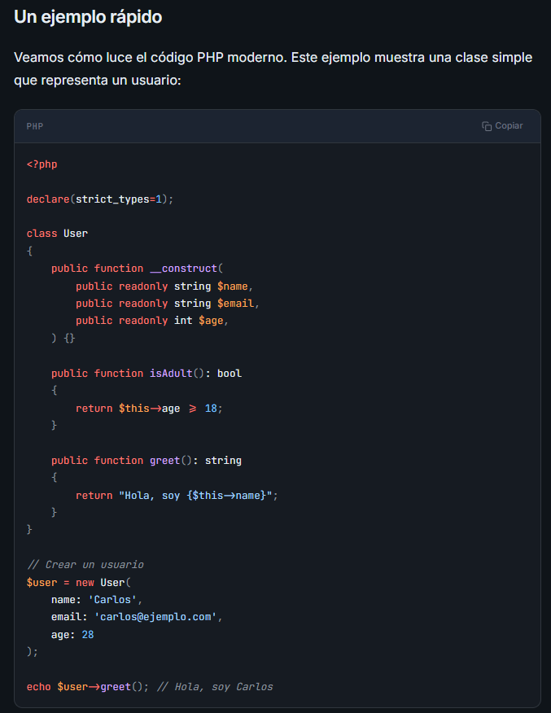

# Introduccion a PHP moderno, curso gratuito en Linea Creado por CursosDesarrolloWeb.es

He decidido iniciar este curso con la finalidad de aprender acerca del lenguaje de programacion PHP, y de paso utilizar herramientas como git y GitHub para poder documentar el proceso de aprendizaje y asi poder guardar un registro e historial de la ruta de aprendizaje, enfocado en herramientas que seran de mucha utilidad para mi desarrollo educativo y profesional.

***************************************************************************************************
IMPORTANTE:
Las siguientes definiciones han sido tomadas del curso de PHP Moderno de CursosDesarrolloWeb.es, y son utilizadas con fines educativos y de aprendizaje.

¿Qué es PHP y por qué aprenderlo en 2026?
En esta primera lección descubrirás qué es PHP, cómo ha evolucionado hasta convertirse en uno de los lenguajes más utilizados del mundo, y por qué sigue siendo una excelente opción para desarrollar aplicaciones web modernas.

¿Qué es PHP?
PHP (acrónimo recursivo de PHP: Hypertext Preprocessor) es un lenguaje de programación de propósito general, especialmente diseñado para el desarrollo web del lado del servidor (backend).

Cuando visitas una página web dinámica, es muy probable que PHP esté trabajando detrás de escena: procesando formularios, consultando bases de datos, gestionando sesiones de usuario, y generando el HTML que tu navegador muestra.

Dato curioso
PHP fue creado en 1994 por Rasmus Lerdorf. Lo que empezó como un conjunto de scripts personales para su página web, hoy impulsa más del 75% de los sitios web del mundo, incluyendo WordPress, Facebook, y Wikipedia.

**************************************************************************************************
PHP en 2026: Más vivo que nunca
Quizás hayas escuchado que "PHP está muerto". Nada más lejos de la realidad. PHP ha experimentado una transformación radical en los últimos años:

PHP 7 (2015) trajo mejoras de rendimiento de hasta un 200%
PHP 8.0 (2020) introdujo JIT compilation, union types, y match expressions
PHP 8.1 añadió enums, fibers, y readonly properties
PHP 8.2 trajo readonly classes y mejoras en tipos
PHP 8.3 mejoró el tipado y añadió nuevas funciones
PHP 8.4 y 8.5 continúan la evolución

El PHP moderno es un lenguaje tipado, con características de programación funcional, orientado a objetos, con un ecosistema maduro de herramientas y frameworks.

***************************************************************************************************
¿Qué puedes construir con PHP?
PHP es extremadamente versátil. Algunos ejemplos de lo que puedes crear:

Sitios web dinámicos - Blogs, portfolios, páginas corporativas
Tiendas online - E-commerce con WooCommerce, Magento, PrestaShop
Aplicaciones web - SaaS, dashboards, sistemas de gestión
APIs REST - Backends para aplicaciones móviles y SPAs
CMS - WordPress, Drupal, Joomla
Herramientas CLI - Scripts de automatización y comandos

***************************************************************************************************
¿Por qué aprender PHP en 2026?
Hay varias razones de peso para elegir PHP como tu lenguaje de backend:

1. Demanda laboral
Miles de empresas buscan desarrolladores PHP. WordPress, que usa PHP, impulsa más del 40% de todos los sitios web. Hay trabajo de sobra.

2. Curva de aprendizaje amigable
PHP es más fácil de aprender que otros lenguajes de backend. Puedes empezar a ver resultados desde el primer día, lo que mantiene la motivación alta.

3. Ecosistema maduro
Frameworks como Laravel, Symfony, y herramientas como Composer hacen que desarrollar sea un placer. No tienes que reinventar la rueda.

4. Hosting económico
Prácticamente cualquier hosting soporta PHP. Es más barato y fácil de desplegar que muchas otras tecnologías.

5. Comunidad enorme
Documentación abundante, tutoriales, Stack Overflow lleno de respuestas. Nunca estarás solo cuando tengas un problema.

El camino después de PHP
Una vez domines PHP, el salto a frameworks como Laravel es natural. Y las habilidades que adquieras (lógica de programación, bases de datos, HTTP, APIs) te servirán para cualquier otro lenguaje que quieras aprender después.

***************************************************************************************************
